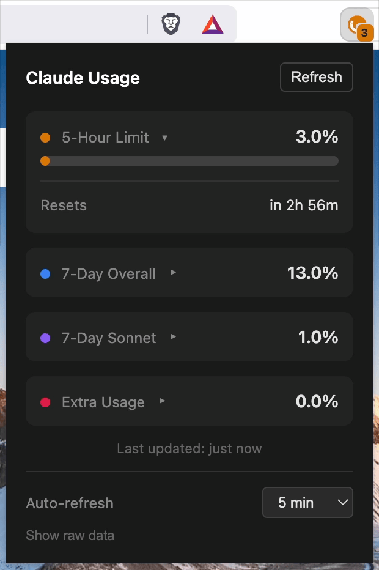

# Claude Usage Monitor

> **Unofficial & Experimental** — This extension uses undocumented internal APIs and may break at any time without notice.

A browser extension that displays your Claude AI usage status in the browser toolbar. Supports Chrome and Firefox.



## Important Notice

This extension is **not affiliated with, endorsed by, or supported by Anthropic**. It relies on internal API endpoints that are not part of Anthropic's public API. These endpoints:

- Could change or be deprecated without notice
- Are not officially supported for third-party use
- May stop working at any time

Anthropic has clarified that they cannot officially endorse the use of internal API endpoints in third-party applications. This extension is provided as-is for users who find it useful and understand the risks.

## Features

- Shows usage percentage directly on the extension badge
- Cycles through all available usage limits with color-coded indicators:
  - **Orange** — 5-hour limit
  - **Blue** — 7-day overall
  - **Purple** — 7-day Sonnet
  - **Pink** — 7-day Opus
  - **Pink-light** — 7-day Design (Claude Design)
  - **Cyan** — 7-day OAuth Apps
  - **Green** — 7-day Cowork
  - **Gray** — Other
  - **Sky** — Routine Runs (daily)
  - **Rose** — Extra Usage
- Toggle individual metrics on/off from the badge cycle
- Detailed popup with progress bars and reset times
- Collapsible cards — click any card to collapse/expand; layout persists across sessions
- Extra Usage section showing monthly limit, amount used, and prepaid credit balance
- Routine Runs showing daily limit and usage count
- Raw API data viewer with copy-to-clipboard
- Automatic retry with exponential backoff on rate-limited (429) responses
- Configurable auto-refresh interval (2–30 min)
- Works with your existing Claude session (no API key needed)
- All data stays local — nothing ever leaves your browser

## Installation

- **Chrome:** [Chrome Web Store](https://chromewebstore.google.com/detail/claude-usage-monitor/ieengjioikahclfklclkjgfobgmnndee)
- **Firefox:** [Firefox Add-ons](https://addons.mozilla.org/en-GB/firefox/addon/the-claude-usage-monitor/)

### Build from source

```bash
git clone https://github.com/mrpesho/claude-usage-monitor.git
cd claude-usage-monitor
npm install
npm run build          # Chrome → .output/chrome-mv3/
npm run build:firefox  # Firefox → .output/firefox-mv2/
```

Load the output folder as an unpacked extension in Chrome (`chrome://extensions/` → Developer mode → Load unpacked) or Firefox (`about:debugging` → Load Temporary Add-on → select `manifest.json`).

## Requirements

- Chrome (or Chromium-based browser: Brave, Edge) — or Firefox
- You must be logged into [claude.ai](https://claude.ai) in your browser
- The extension uses your existing browser session cookies

## How It Works

The extension fetches usage data from Claude's internal API endpoints using your existing browser session:

1. `/api/bootstrap` — Gets your organization ID from your logged-in session
2. `/api/organizations/{orgId}/usage` — Fetches your current usage data
3. `/api/organizations/{orgId}/prepaid/credits` — Fetches your prepaid credit balance
4. `/v1/code/routines/run-budget` — Fetches your daily routine run budget

**Privacy:** The extension does not extract or store your login credentials. It relies on your existing browser session to fetch data from claude.ai. All data is cached locally in your browser's extension storage and never leaves your browser.

## Updating

Updates are delivered automatically through the Chrome Web Store and Firefox Add-ons.

## Troubleshooting

**Badge shows "!" (orange)**
- You're not logged into claude.ai. Visit [claude.ai](https://claude.ai) and log in.

**Badge shows "X" (red)**
- There was an error fetching data. Click the extension to see details.

**Extension stopped working**
- Anthropic may have changed their internal API. Check this repository for updates or open an issue.

## Disclaimer

This is an unofficial, experimental extension provided "as is" without warranty of any kind.

- **Not affiliated with Anthropic** — This project has no official relationship with Anthropic
- **Use at your own risk** — The extension may stop working if Anthropic changes their internal APIs
- **No guarantees** — Functionality and availability are not guaranteed

Please review [Anthropic's Terms of Service](https://www.anthropic.com/legal/consumer-terms) and use your own judgment.

## Contributing

Issues and pull requests are welcome. If the extension breaks due to API changes, please open an issue.

## License

BSD-3-Clause
