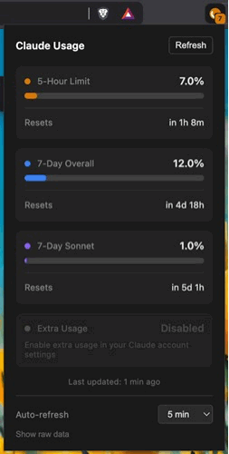

# Claude Usage Monitor

> **Unofficial & Experimental** — This extension uses undocumented internal APIs and may break at any time without notice.

A Chrome extension that displays your Claude AI usage status in the browser toolbar.



## Important Notice

This extension is **not affiliated with, endorsed by, or supported by Anthropic**. It relies on internal API endpoints that are not part of Anthropic's public API. These endpoints:

- Could change or be deprecated without notice
- Are not officially supported for third-party use
- May stop working at any time

Anthropic has clarified that they cannot officially endorse the use of internal API endpoints in third-party applications. This extension is provided as-is for users who find it useful and understand the risks.

## Features

- Shows usage percentage directly on the extension badge
- Cycles through all available usage limits with color-coded indicators:
  - **Orange** — 5-hour limit
  - **Blue** — 7-day overall
  - **Purple** — 7-day Sonnet
  - **Pink** — 7-day Opus
  - **Cyan** — 7-day OAuth Apps
  - **Green** — 7-day Cowork
  - **Gray** — Other
  - **Rose** — Extra Usage
- Detailed popup with progress bars and reset times
- Collapsible cards — click any card to collapse/expand; layout persists across sessions
- Extra Usage section showing monthly limit, amount used, and computed percentage
- Automatic retry with exponential backoff on rate-limited (429) responses
- Configurable auto-refresh interval (5min – 1hour)
- Works with your existing Claude session (no API key needed)
- All data stays local — nothing is sent to third parties

## Installation

Since this is an unofficial extension, it's distributed via GitHub and must be installed manually in developer mode.

### Step 1: Download

**Option A: Download from Releases (Recommended)**
1. Go to the [Releases](../../releases) page
2. Download the latest `claude-usage-monitor-vX.X.X.zip`
3. Extract the ZIP to a folder on your computer

**Option B: Clone with Git**
```bash
git clone https://github.com/mrpesho/claude-usage-monitor.git
```

**Option C: Download source ZIP**
1. Click the green **Code** button above
2. Select **Download ZIP**
3. Extract the ZIP to a folder on your computer

### Step 2: Install in Chrome

1. Open Chrome and navigate to `chrome://extensions/`
2. Enable **Developer mode** (toggle in the top-right corner)
3. Click **Load unpacked**
4. Select the `claude-usage-monitor` folder (the one containing `manifest.json`)
5. The extension icon should appear in your toolbar

### Step 3: Pin the Extension (Optional)

1. Click the puzzle piece icon in Chrome's toolbar
2. Find "Claude Usage Monitor" and click the pin icon
3. The extension badge will now always be visible

## Requirements

- Google Chrome (or Chromium-based browser like Brave, Edge)
- You must be logged into [claude.ai](https://claude.ai) in your browser
- The extension uses your existing browser session cookies

## How It Works

The extension fetches usage data from Claude's internal API endpoints using your existing browser session. Specifically:

1. `/api/bootstrap` — Gets your organization ID from your logged-in session
2. `/api/organizations/{orgId}/usage` — Fetches your current usage data

**Privacy:** The extension does not store or transmit your credentials anywhere. All data is kept locally in your browser's extension storage.

## Updating

Since this isn't installed from the Chrome Web Store, you'll need to update manually:

1. Download the latest release or pull changes (`git pull`)
2. Replace the extension files (or extract to the same folder)
3. Go to `chrome://extensions/`
4. Click the refresh icon on the Claude Usage Monitor card

## Troubleshooting

**Badge shows "!" (orange)**
- You're not logged into claude.ai. Visit [claude.ai](https://claude.ai) and log in.

**Badge shows "X" (red)**
- There was an error fetching data. Click the extension to see details.

**Extension stopped working**
- Anthropic may have changed their internal API. Check this repository for updates or open an issue.

## Disclaimer

This is an unofficial, experimental extension provided "as is" without warranty of any kind.

- **Not affiliated with Anthropic** — This project has no official relationship with Anthropic
- **Use at your own risk** — The extension may stop working if Anthropic changes their internal APIs
- **No guarantees** — Functionality and availability are not guaranteed

Please review [Anthropic's Terms of Service](https://www.anthropic.com/legal/consumer-terms) and use your own judgment.

## Contributing

Issues and pull requests are welcome. If the extension breaks due to API changes, please open an issue.

## License

BSD-3-Clause
